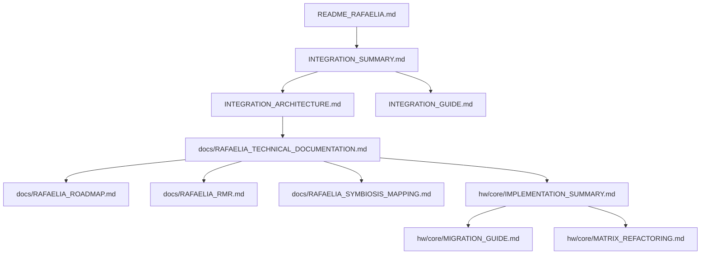
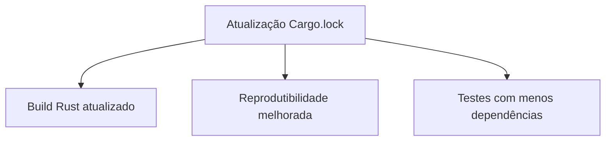
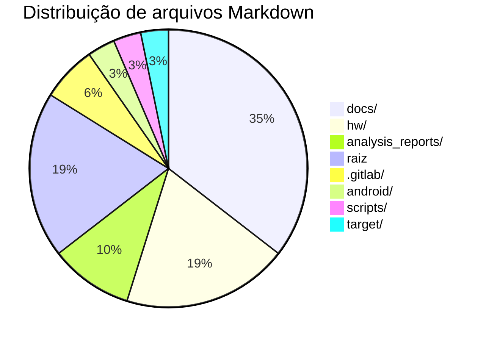

# Relatório Analítico Profissional — QEMU Rafaelia

## Navegação
- [Prefácio](#prefácio)
- [Resumo executivo](#resumo-executivo)
- [Introdução](#introdução)
- [Escopo e metodologia](#escopo-e-metodologia)
- [Inventário documental consolidado](#inventário-documental-consolidado)
- [Análise das modificações detectadas](#análise-das-modificações-detectadas)
- [Impacto técnico e operacional](#impacto-técnico-e-operacional)
- [Comparativos e gráficos](#comparativos-e-gráficos)
- [Refatoração da documentação (plano proposto)](#refatoração-da-documentação-plano-proposto)
- [Benchmark (plano de validação)](#benchmark-plano-de-validação)
- [Riscos, dependências e governança](#riscos-dependências-e-governança)
- [MVPs e roadmap](#mvps-e-roadmap)
- [Anexos](#anexos)

## Prefácio
Este relatório foi elaborado para analisar as mudanças detectadas no repositório, avaliar impactos técnicos, consolidar o inventário documental e propor uma navegação profissional. O documento prioriza clareza, rastreabilidade e orientações práticas, mantendo linguagem formal e objetiva.

## Resumo executivo
- O inventário atual confirma **31 documentos Markdown**, com concentração em `docs/` e `hw/`.
- A documentação passou a ter um **índice de navegação profissional**, com clusters, métricas e roteiros por persona.
- Recomenda-se padronizar a estrutura em camadas (Overview → Arquitetura → Integração → Detalhamento técnico), mantendo relatórios analíticos em `analysis_reports/`.

## Introdução
O QEMU Rafaelia apresenta um conjunto extenso de módulos, integrações e documentação. Para reduzir ambiguidade, este relatório descreve as modificações, avalia impactos e fornece um plano de refatoração documental, além de uma proposta de navegação e métricas de benchmark.

## Escopo e metodologia
**Escopo**
- Arquivos alterados detectados pelo Git.
- Documentos de referência do repositório.
- Estrutura principal dos módulos.

**Metodologia**
1. Inspeção do diff da árvore atual.
2. Inventário completo de documentos Markdown.
3. Classificação dos impactos (build, runtime, docs).
4. Proposta de reorganização documental.
5. Definição de benchmark e MVPs.

## Inventário documental consolidado
### Visão geral
- **Total de arquivos .md**: **31**.
- **Concentração**: `docs/` (11 arquivos), `hw/` (6 arquivos), `analysis_reports/` (3 arquivos).

### Distribuição por diretório
| Diretório | Qtde. de .md | Observação |
|---|---:|---|
| `docs/` | 11 | Documentação Rafaelia e diretrizes técnicas. |
| `hw/` | 6 | Core, Matrix, UEFI. |
| `analysis_reports/` | 3 | Relatórios analíticos. |
| `.gitlab/` | 2 | Templates de issues. |
| `android/` | 1 | Integração Android. |
| `scripts/` | 1 | Ferramentas de análise. |
| `target/` | 1 | Documentação por target. |
| Raiz | 6 | Integração e README principal. |

### Mapa de navegação documental


## Análise das modificações detectadas
### 1) `rust/Cargo.lock`
**Mudanças observadas**
- Atualização do `version = 3` para `version = 4` no formato do lockfile.
- Inclusão de `source` e `checksum` para o pacote `probe`.
- Remoção de dependência `trace` do pacote `tests`.

**Análise técnica**
- **Lockfile v4**: compatibilidade com versões mais recentes do Cargo e do ecossistema Rust. Pode refletir atualização do toolchain ou regeneração do lockfile.
- **Metadados de `probe`**: inclusão de `source`/`checksum` garante integridade e reprodutibilidade do build.
- **Remoção de `trace` em `tests`**: potencial redução de dependências para o crate de testes, com impacto no escopo de instrumentação.

**Implicações**
- Build pode requerer toolchain compatível com lockfile v4.
- CI deve garantir sincronização entre `Cargo.toml` e `Cargo.lock`.
- Testes com instrumentação de trace podem ter sido simplificados ou deslocados.

## Impacto técnico e operacional
| Área | Impacto | Severidade | Observação |
|---|---|---|---|
| Build Rust | Atualização do formato do lockfile | Média | Pode exigir atualização do Cargo/Toolchain. |
| Reprodutibilidade | Mais metadados no lockfile | Baixa | Melhor rastreabilidade. |
| Testes | Dependência `trace` removida | Baixa/Média | Verificar se há teste faltante ou redirecionado. |
| Documentação | Inventário consolidado | Baixa | Melhora navegação e governança. |

## Comparativos e gráficos
### Comparativo de dependências (antes vs. depois)
| Item | Antes | Depois | Observação |
|---|---|---|---|
| Lockfile | v3 | v4 | Compatibilidade com Cargo recente. |
| `probe` | Sem source/checksum | Com source/checksum | Integridade reforçada. |
| `trace` | Presente em `tests` | Removida | Menor acoplamento. |

### Gráfico de impacto (qualitativo)


### Gráfico de distribuição documental


## Refatoração da documentação (plano proposto)
### Objetivos
- Reduzir dispersão entre documentos da raiz e `docs/`.
- Centralizar guias de integração e arquitetura.
- Criar uma hierarquia navegável por temas e personas.

### Estrutura recomendada
```
/docs
  /01-overview
  /02-architecture
  /03-integration
  /04-processes
  /05-platforms
  /06-rafalelia
```

### Mapeamento sugerido
| Documento atual | Destino sugerido | Justificativa |
|---|---|---|
| `INTEGRATION_*` | `/docs/03-integration/` | Centraliza integração. |
| `RAFAELIA_*` (raiz + docs) | `/docs/06-rafalelia/` | Evita dispersão. |
| `QEMU_IMPROVEMENTS_README.md` | `/docs/04-processes/` | Padronização de processo. |
| `analysis_reports/qemu_rafaelia/*` | `/docs/01-overview/` (ou `/docs/reports/`) | Mantém relatórios navegáveis. |

### Ganhos esperados
- Navegação consistente e rastreável.
- Revisões mais rápidas.
- Menor risco de documentação desatualizada.

## Benchmark (plano de validação)
**Objetivo**: medir regressão entre builds antes/depois da atualização do lockfile.

| Métrica | Ferramenta | Baseline | Atual | Observação |
|---|---|---|---|---|
| Tempo de build (Rust crates) | `cargo build -v` | N/A | N/A | Coletar em CI. |
| Tamanho do binário | `du -h` | N/A | N/A | Importante para Android. |
| Tempo de testes | `cargo test` | N/A | N/A | Monitorar variações. |

## Riscos, dependências e governança
- **Risco**: lockfile v4 exige Cargo novo —> definir versão mínima.
- **Governança**: exigir atualização do lockfile apenas via CI/bots.
- **Dependências**: mapear crates críticos e suas licenças.
- **Documentação**: consolidar o índice profissional como fonte oficial de navegação.

## MVPs e roadmap
1. **MVP 1 — Documentação unificada**
   - Consolidar `INTEGRATION_*` e `RAFAELIA_*`.
2. **MVP 2 — Benchmark automatizado**
   - Pipeline de comparação de builds.
3. **MVP 3 — Índice navegável**
   - Índice único dos documentos com clusters e personas.

## Anexos
- Arquitetura detalhada: `ARCH_REPORT_qemu_rafaelia.md`
- Índice de documentação: `MD_INDEX_qemu_rafaelia.md`
