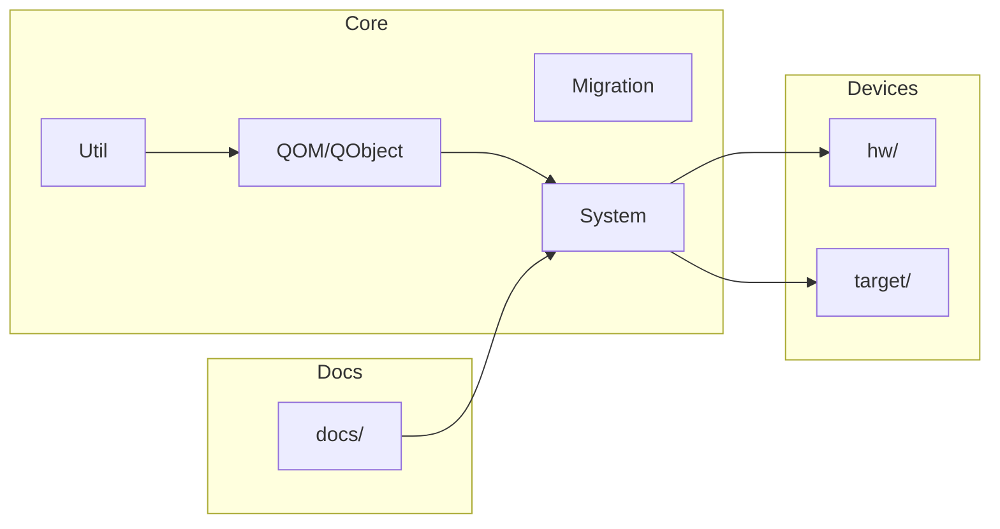

# Relatório de Arquitetura — QEMU Rafaelia

## Navegação
- [1. Visão geral](#1-visão-geral)
- [2. Build system](#2-build-system)
- [3. Módulos principais (top-level dirs)](#3-módulos-principais-top-level-dirs)
- [4. Pontos de entrada relevantes](#4-pontos-de-entrada-relevantes)
- [5. Mapa de dependências (alto nível)](#5-mapa-de-dependências-alto-nível)
- [6. Riscos e oportunidades arquiteturais](#6-riscos-e-oportunidades-arquiteturais)

## 1. Visão geral
Este projeto é uma distribuição do QEMU com adaptações “Rafaelia”. A estrutura evidencia um núcleo C/C++ clássico do QEMU, com módulos por subsistema (CPU, devices, migration, storage, etc.), além de uma camada crescente de componentes Rust. O repositório também inclui documentação extensa em `docs/`, scripts de build e automação, além de artefatos específicos para Android.

## 2. Build system
**Sistemas de build detectados**

| Sistema | Evidência | Uso típico | Observações |
|---|---|---|---|
| Autotools (`configure`) | `configure` (raiz) | Configuração inicial | Fluxo tradicional do QEMU. |
| Make | `Makefile` (raiz) | Compilação principal | Integrado ao `configure`. |
| Meson | `meson.build`, `meson_options.txt` | Alternativa moderna | Também presente em `docs/meson.build`. |
| Gradle (Android) | `android/vectras-vm-android/gradle/` | App Android | Projeto Android separado. |

## 3. Módulos principais (top-level dirs)
Resumo dos módulos mais relevantes no nível raiz:

- **`accel/`** — Aceleração (kvm, xen, tcg, etc.)
- **`android/`** — Aplicativo Android (vectras-vm-android)
- **`block/`** — Storage/block layer
- **`docs/`** — Documentação extensa do QEMU + Rafaelia
- **`hw/`** — Dispositivos, máquinas e boards
- **`include/`** — Headers públicos e internos
- **`migration/`** — Live migration
- **`net/`** — Rede
- **`qom/` / `qobject/`** — Object model do QEMU
- **`rust/`** — Componentes Rust
- **`system/`** — System emulation
- **`target/`** — Alvos/arquiteturas (TCG, KVM, etc.)
- **`tests/`** — Testes
- **`tools/`** — Ferramentas auxiliares
- **`ui/`** — Interface gráfica

## 4. Pontos de entrada relevantes
- **Documentação de targets e hardware**: diretórios `docs/system/` (targets) e `hw/` (subcomponentes de hardware) concentram conteúdo técnico e referências de dispositivos.
- **Android**: `android/vectras-vm-android/` (app e build com Gradle).
- **Rust crates internos**: `rust/*/` com crates como `system`, `qom`, `migration`, `util`, `trace`.

> Observação: a orientação “QEMU: targets/hw/*/docs” não aparece literalmente na árvore. Em vez disso, a documentação está centralizada em `docs/` e o hardware em `hw/`.

## 5. Mapa de dependências (alto nível)

## 6. Riscos e oportunidades arquiteturais
- **Risco: complexidade multi-build (configure + meson + gradle)**
  - Mitigação: padronizar um “build matrix” com pipelines e documentação clara.
- **Oportunidade: consolidação de documentação Rafaelia**
  - Unificar documentação espalhada em `docs/` e na raiz (arquivos Rafaelia em múltiplos locais).
- **Risco: divergência entre docs e implementação**
  - Mitigação: introduzir validações (ex.: `docs/` gerado por Sphinx como check).
