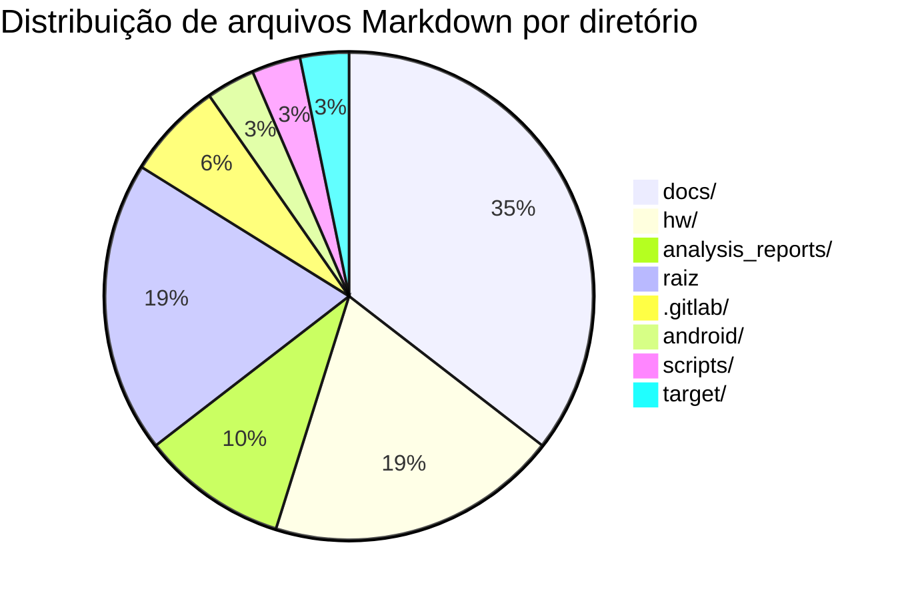
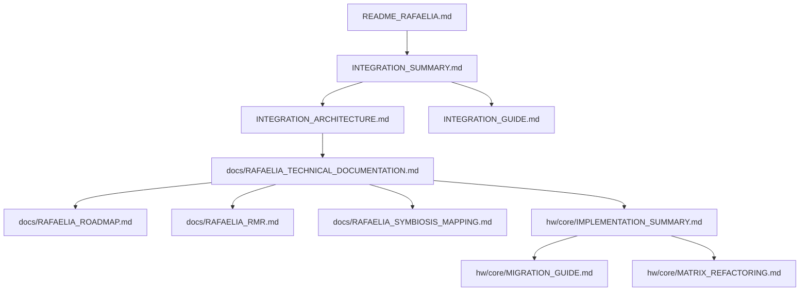

# MD Index — QEMU Rafaelia

## Navegação
- [Resumo executivo do índice](#resumo-executivo-do-índice)
- [1. Inventário completo de arquivos .md](#1-inventário-completo-de-arquivos-md)
- [2. Clusters de documentação (com propósito)](#2-clusters-de-documentação-com-propósito)
- [3. Métricas e gráficos de distribuição](#3-métricas-e-gráficos-de-distribuição)
- [4. Árvore resumida (até 3 níveis)](#4-árvore-resumida-até-3-níveis)
- [5. Top 10 arquivos mais importantes](#5-top-10-arquivos-mais-importantes)
- [6. Checklist de build/exec](#6-checklist-de-buildexec)
- [7. Rotas de navegação profissional (por persona)](#7-rotas-de-navegação-profissional-por-persona)

## Resumo executivo do índice
- **Total de arquivos Markdown**: **31**.
- **Concentração principal**: `docs/` (11 arquivos) e `hw/` (6 arquivos).
- **Áreas com documentação crítica**: integração (raiz), Rafaelia (docs/), hardware (hw/core/) e análises (analysis_reports/).

## 1. Inventário completo de arquivos .md
| Arquivo | Cluster | Objetivo | Navegação rápida |
|---|---|---|---|
| `.gitlab/issue_templates/bug.md` | Templates de issues | Reporte de bugs | [Abrir](../../.gitlab/issue_templates/bug.md) |
| `.gitlab/issue_templates/feature_request.md` | Templates de issues | Solicitar features | [Abrir](../../.gitlab/issue_templates/feature_request.md) |
| `INTEGRATION_ARCHITECTURE.md` | Integração (raiz) | Arquitetura estratégica | [Abrir](../../INTEGRATION_ARCHITECTURE.md) |
| `INTEGRATION_GUIDE.md` | Integração (raiz) | Guia de uso e API | [Abrir](../../INTEGRATION_GUIDE.md) |
| `INTEGRATION_SUMMARY.md` | Integração (raiz) | Sumário da implementação | [Abrir](../../INTEGRATION_SUMMARY.md) |
| `QEMU_IMPROVEMENTS_README.md` | Processos (raiz) | Melhorias propostas | [Abrir](../../QEMU_IMPROVEMENTS_README.md) |
| `RAFAELIA_IMPLEMENTATION.md` | Rafaelia (raiz) | Implementação núcleo | [Abrir](../../RAFAELIA_IMPLEMENTATION.md) |
| `README_RAFAELIA.md` | Rafaelia (raiz) | README principal | [Abrir](../../README_RAFAELIA.md) |
| `analysis_reports/qemu_rafaelia/ANALYSIS_REPORT_qemu_rafaelia.md` | Análises | Relatório analítico | [Abrir](ANALYSIS_REPORT_qemu_rafaelia.md) |
| `analysis_reports/qemu_rafaelia/ARCH_REPORT_qemu_rafaelia.md` | Análises | Relatório de arquitetura | [Abrir](ARCH_REPORT_qemu_rafaelia.md) |
| `analysis_reports/qemu_rafaelia/MD_INDEX_qemu_rafaelia.md` | Análises | Índice documental | [Abrir](MD_INDEX_qemu_rafaelia.md) |
| `android/vectras-vm-android/README.md` | Plataformas | Android/Vectras VM | [Abrir](../../android/vectras-vm-android/README.md) |
| `docs/ERROR_HANDLING_PATTERNS.md` | Padrões | Erros e resiliência | [Abrir](../../docs/ERROR_HANDLING_PATTERNS.md) |
| `docs/QEMU_PROCESS_IMPROVEMENTS.md` | Processos | Melhorias de processo | [Abrir](../../docs/QEMU_PROCESS_IMPROVEMENTS.md) |
| `docs/RAFAELIA_AUTHORSHIP_BOUNDARIES.md` | Rafaelia (docs) | Autoria e limites | [Abrir](../../docs/RAFAELIA_AUTHORSHIP_BOUNDARIES.md) |
| `docs/RAFAELIA_MODULOMR.md` | Rafaelia (docs) | Módulo MR | [Abrir](../../docs/RAFAELIA_MODULOMR.md) |
| `docs/RAFAELIA_PROFESSIONAL_DOSSIER.md` | Rafaelia (docs) | Dossiê profissional | [Abrir](../../docs/RAFAELIA_PROFESSIONAL_DOSSIER.md) |
| `docs/RAFAELIA_RMR.md` | Rafaelia (docs) | RMR | [Abrir](../../docs/RAFAELIA_RMR.md) |
| `docs/RAFAELIA_ROADMAP.md` | Rafaelia (docs) | Roadmap | [Abrir](../../docs/RAFAELIA_ROADMAP.md) |
| `docs/RAFAELIA_RUNTIME_HOOK.md` | Rafaelia (docs) | Runtime hook | [Abrir](../../docs/RAFAELIA_RUNTIME_HOOK.md) |
| `docs/RAFAELIA_SYMBIOSIS_MAPPING.md` | Rafaelia (docs) | Mapa de simbiose | [Abrir](../../docs/RAFAELIA_SYMBIOSIS_MAPPING.md) |
| `docs/RAFAELIA_TECHNICAL_DOCUMENTATION.md` | Rafaelia (docs) | Documentação técnica | [Abrir](../../docs/RAFAELIA_TECHNICAL_DOCUMENTATION.md) |
| `docs/UI_UX_INTEGRATION_GUIDELINES.md` | UI/UX | Diretrizes UI/UX | [Abrir](../../docs/UI_UX_INTEGRATION_GUIDELINES.md) |
| `hw/core/IMPLEMENTATION_SUMMARY.md` | Hardware/core | Sumário do core | [Abrir](../../hw/core/IMPLEMENTATION_SUMMARY.md) |
| `hw/core/MATRIX_REFACTORING.md` | Hardware/core | Refatoração Matrix | [Abrir](../../hw/core/MATRIX_REFACTORING.md) |
| `hw/core/MIGRATION_GUIDE.md` | Hardware/core | Guia de migração | [Abrir](../../hw/core/MIGRATION_GUIDE.md) |
| `hw/core/RAFAELIA_README.md` | Hardware/core | README Rafaelia | [Abrir](../../hw/core/RAFAELIA_README.md) |
| `hw/core/README_MATRIX.md` | Hardware/core | README Matrix | [Abrir](../../hw/core/README_MATRIX.md) |
| `hw/uefi/LIMITATIONS.md` | Hardware/UEFI | Limitações UEFI | [Abrir](../../hw/uefi/LIMITATIONS.md) |
| `scripts/coverity-scan/COMPONENTS.md` | Ferramentas | Cobertura Coverity | [Abrir](../../scripts/coverity-scan/COMPONENTS.md) |
| `target/i386/hvf/README.md` | Targets | HVF i386 | [Abrir](../../target/i386/hvf/README.md) |

## 2. Clusters de documentação (com propósito)
- **Integração e visão geral (raiz)**
  - `INTEGRATION_*`, `QEMU_IMPROVEMENTS_README.md`, `RAFAELIA_IMPLEMENTATION.md`, `README_RAFAELIA.md`.
- **Documentação Rafaelia (docs/)**
  - `docs/RAFAELIA_*` e `docs/UI_UX_INTEGRATION_GUIDELINES.md`.
- **Processos e padrões (docs/)**
  - `docs/ERROR_HANDLING_PATTERNS.md`, `docs/QEMU_PROCESS_IMPROVEMENTS.md`.
- **Hardware/core (hw/core/)**
  - `IMPLEMENTATION_SUMMARY.md`, `MATRIX_REFACTORING.md`, `MIGRATION_GUIDE.md`, `RAFAELIA_README.md`, `README_MATRIX.md`.
- **Plataformas e targets específicos**
  - `android/vectras-vm-android/README.md`, `hw/uefi/LIMITATIONS.md`, `target/i386/hvf/README.md`.
- **Ferramentas/segurança**
  - `scripts/coverity-scan/COMPONENTS.md`.
- **Análises e relatórios**
  - `analysis_reports/qemu_rafaelia/*.md`.
- **Templates de issues**
  - `.gitlab/issue_templates/*.md`.

## 3. Métricas e gráficos de distribuição
### Distribuição por diretório (top-level)
| Diretório | Qtde. de .md | Observação |
|---|---:|---|
| `docs/` | 11 | Núcleo Rafaelia e diretrizes técnicas. |
| `hw/` | 6 | Core, Matrix e UEFI. |
| `analysis_reports/` | 3 | Relatórios analíticos. |
| `.gitlab/` | 2 | Templates de issues. |
| `android/` | 1 | Integração Android. |
| `scripts/` | 1 | Ferramentas de análise. |
| `target/` | 1 | Docs por target. |
| Raiz | 6 | Integração e README principal. |

### Gráfico de cobertura documental


### Fluxo recomendado de leitura (mapa de navegação)


## 4. Árvore resumida (até 3 níveis)
```text
./
  analysis_reports/
    qemu_rafaelia/
      ANALYSIS_REPORT_qemu_rafaelia.md
      ARCH_REPORT_qemu_rafaelia.md
      MD_INDEX_qemu_rafaelia.md
  android/
    vectras-vm-android/
      README.md
  docs/
    ERROR_HANDLING_PATTERNS.md
    QEMU_PROCESS_IMPROVEMENTS.md
    RAFAELIA_AUTHORSHIP_BOUNDARIES.md
    RAFAELIA_MODULOMR.md
    RAFAELIA_PROFESSIONAL_DOSSIER.md
    RAFAELIA_RMR.md
    RAFAELIA_ROADMAP.md
    RAFAELIA_RUNTIME_HOOK.md
    RAFAELIA_SYMBIOSIS_MAPPING.md
    RAFAELIA_TECHNICAL_DOCUMENTATION.md
    UI_UX_INTEGRATION_GUIDELINES.md
  hw/
    core/
      IMPLEMENTATION_SUMMARY.md
      MATRIX_REFACTORING.md
      MIGRATION_GUIDE.md
      RAFAELIA_README.md
      README_MATRIX.md
    uefi/
      LIMITATIONS.md
  scripts/
    coverity-scan/
      COMPONENTS.md
  target/
    i386/
      hvf/
        README.md
```

## 5. Top 10 arquivos mais importantes
1. **`README.rst`** — Instruções de build e visão geral do projeto.
2. **`configure`** — Principal entry-point de configuração do build.
3. **`Makefile`** — Orquestração do build clássico.
4. **`meson.build`** — Build alternativo moderno com Meson.
5. **`docs/index.rst`** — Índice principal da documentação.
6. **`README_RAFAELIA.md`** — Entrada principal Rafaelia.
7. **`INTEGRATION_GUIDE.md`** — Guia de integração.
8. **`INTEGRATION_ARCHITECTURE.md`** — Arquitetura de integração.
9. **`docs/RAFAELIA_TECHNICAL_DOCUMENTATION.md`** — Doc técnica especializada.
10. **`hw/core/IMPLEMENTATION_SUMMARY.md`** — Resumo de implementação do núcleo.

## 6. Checklist de build/exec
**Baseado no README.rst**
- [ ] `mkdir build`
- [ ] `cd build`
- [ ] `../configure`
- [ ] `make`

**Notas**
- Verifique dependências específicas por target/host em `docs/` e `README.rst`.
- Para Android, usar o projeto em `android/vectras-vm-android/` via Gradle.

## 7. Rotas de navegação profissional (por persona)
| Persona | Objetivo | Caminho recomendado |
|---|---|---|
| **Arquiteto** | Entender visão estratégica | `README_RAFAELIA.md` → `INTEGRATION_SUMMARY.md` → `INTEGRATION_ARCHITECTURE.md` → `docs/RAFAELIA_TECHNICAL_DOCUMENTATION.md` |
| **Dev de integração** | Implementar e testar APIs | `INTEGRATION_GUIDE.md` → `hw/core/IMPLEMENTATION_SUMMARY.md` → `hw/core/MIGRATION_GUIDE.md` |
| **Gestor de produto** | Roadmap e entregas | `docs/RAFAELIA_ROADMAP.md` → `docs/RAFAELIA_PROFESSIONAL_DOSSIER.md` |
| **QA/Compliance** | Padrões e riscos | `docs/ERROR_HANDLING_PATTERNS.md` → `docs/RAFAELIA_AUTHORSHIP_BOUNDARIES.md` → `analysis_reports/qemu_rafaelia/ANALYSIS_REPORT_qemu_rafaelia.md` |
| **Operações/DevOps** | Processos e build | `QEMU_IMPROVEMENTS_README.md` → `docs/QEMU_PROCESS_IMPROVEMENTS.md` → `README.rst` |
